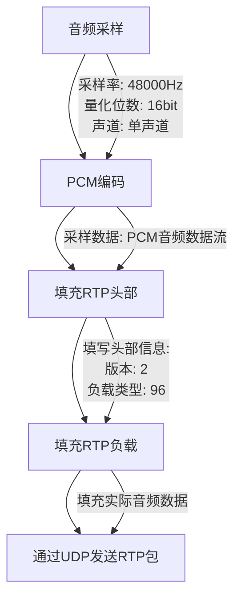

# Network

Network upper host

## 以太网传输模块：

### 实现的功能

将采集的音频信号打成udp包，这里我们使用RTP协议保证音频的同步传输和丢包检测与重传

#### rtp协议

##### 1. RTP简介

RTP是一种用于在IP网络上传输多媒体数据的协议。它通常用于音频和视频的实时传输，具有时间敏感性和流媒体应用的需求。RTP本身并不提供数据传输的保证，但是它提供了一些机制来支持实时传输，如时间戳、序列号和负载类型字段。

##### 2. RTP的主要特性

- **时间戳（Timestamp）**：RTP使用时间戳来标识数据包的发送时间，这对于接收方进行实时重构是非常重要的。
- **序列号（Sequence Number）**：每个RTP数据包都有一个序列号，用于对数据包进行排序和重组，以保证数据的正确顺序。
- **负载类型（Payload Type）**：指示RTP数据包中所携带的数据类型，例如音频、视频或其他多媒体数据类型。
- **同步源（Synchronization Source）**：标识RTP流的同步源，每个RTP流都有一个唯一的SSRC标识符。
- **RTP控制协议（RTCP）**：用于监控RTP会话的协议，提供了QoS信息、流量控制和网络适应性等功能。

##### 3. RTP数据包结构

RTP数据包由头部和负载组成，其头部包括以下字段：

- **版本（Version）**：指示RTP协议的版本号。
- **填充（Padding）**：用于在RTP数据包末尾填充额外的字节以满足特定的要求。
- **扩展（Extension）**：指示RTP头部是否包含扩展部分。
- **CSRC计数（CSRC Count）**：指示RTP数据包中包含的CSRC标识符的数量。
- **标识（Marker）**：指示RTP数据包是否包含重要的事件或关键帧。
- **有效载荷类型（Payload Type）**：指示RTP数据包携带的数据类型。
- **序列号（Sequence Number）**：标识RTP数据包的序列号。
- **时间戳（Timestamp）**：标识RTP数据包的发送时间。
- **同步源（SSRC）**：标识RTP数据包的同步源。
  以下是RTP数据包结构图：

```
 0                   1                   2                   3   
 0 1 2 3 4 5 6 7 8 9 0 1 2 3 4 5 6 7 8 9 0 1 2 3 4 5 6 7 8 9 0 1 
+-+-+-+-+-+-+-+-+-+-+-+-+-+-+-+-+-+-+-+-+-+-+-+-+-+-+-+-+-+-+-+-+
|V=2|P|X|  CC   |M|     PT      |       Sequence Number         |
+-+-+-+-+-+-+-+-+-+-+-+-+-+-+-+-+-+-+-+-+-+-+-+-+-+-+-+-+-+-+-+-+
|                           Timestamp                           |
+-+-+-+-+-+-+-+-+-+-+-+-+-+-+-+-+-+-+-+-+-+-+-+-+-+-+-+-+-+-+-+-+
|           Synchronization Source (SSRC) Identifier            |
+=+=+=+=+=+=+=+=+=+=+=+=+=+=+=+=+=+=+=+=+=+=+=+=+=+=+=+=+=+=+=+=+
|            Contributing Source (CSRC) Identifiers             |
|                             ....                              |
+-+-+-+-+-+-+-+-+-+-+-+-+-+-+-+-+-+-+-+-+-+-+-+-+-+-+-+-+-+-+-+-+
|                          Payload Data                         |
+-+-+-+-+-+-+-+-+-+-+-+-+-+-+-+-+-+-+-+-+-+-+-+-+-+-+-+-+-+-+-+-+
```

- **V**: 2 bits，版本号。
- **P**: 1 bit，填充标志位。
- **X**: 1 bit，扩展标志位。
- **CC**: 4 bits，CSRC计数。
- **M**: 1 bit，标记位。
- **PT**: 7 bits，有效负载类型。
- **Sequence Number**: 16 bits，序列号。
- **Timestamp**: 32 bits，时间戳。
- **SSRC Identifier**: 32 bits，同步源标识符。
- **CSRC Identifiers**: 每个32 bits，贡献源标识符（可选）。
- **Payload Data**: 实际的数据负载。

##### 4. FPGA实现PCM编码后打包成RTP包

FPGA将实时采集的音频数据进行简单的PCM编码，为了方便后续的计算我将本次的PCM音频数据的参数设定为为48000Hz 16bit  mono，即48kHz采样率16bit单通道。
将PCM数据流填入RTP的payload也就是实际的数据负载后，交给udp模块进行打包发送。




##### 5. FPGA实现中的考虑因素


### 系统处理延迟

|  | col2 | col3 |
| - | ---- | ---- |
|  |      |      |
|  |      |      |

### 资源使用率

### 作品完成情况

### 性能参数

## 模块一：

### 实现的功能

### 系统处理延迟

### 资源使用率

### 作品完成情况

### 性能参数

## 模块一：

### 实现的功能

### 系统处理延迟

### 资源使用率

### 作品完成情况

### 性能参数

## 模块一：

### 实现的功能

### 系统处理延迟

### 资源使用率

### 作品完成情况

### 性能参数
